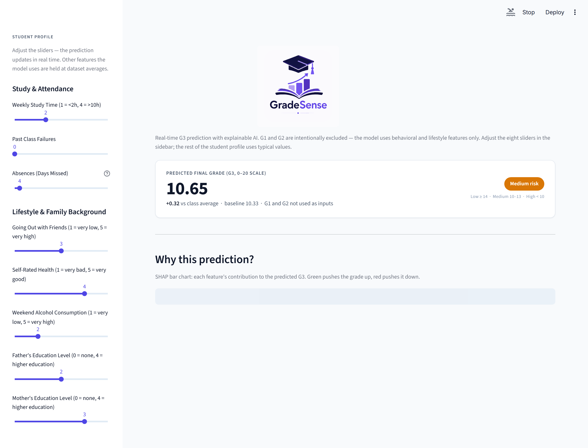
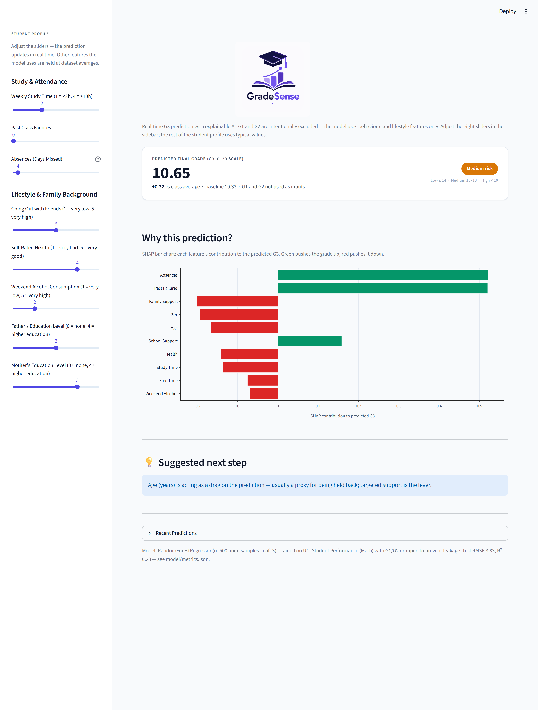
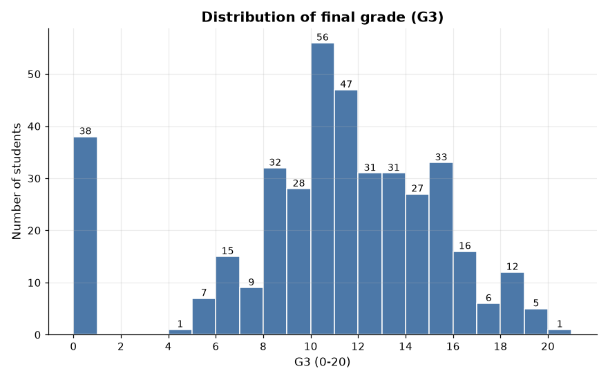
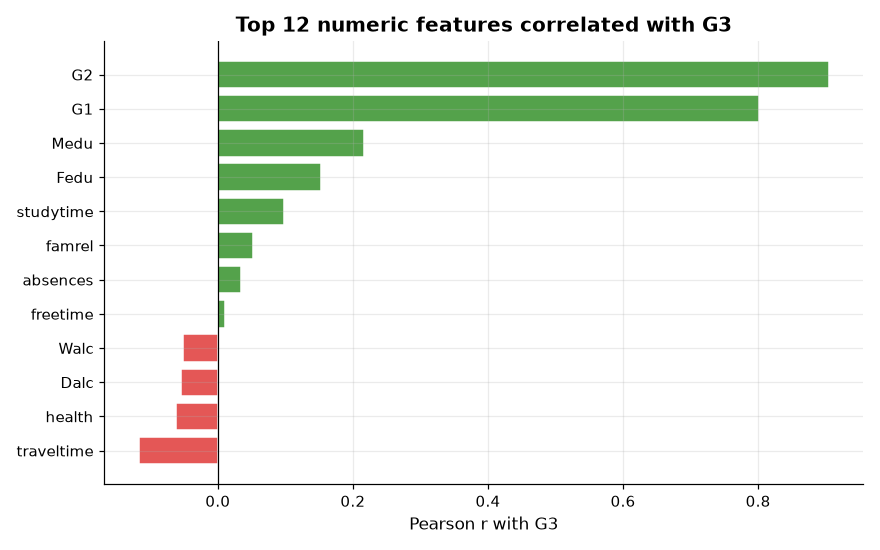
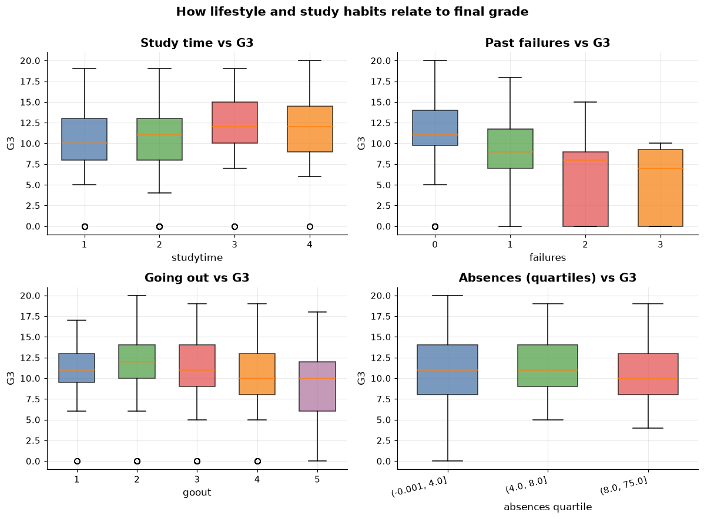
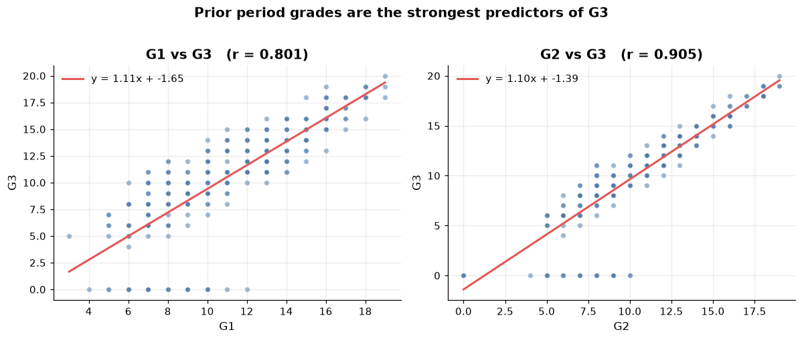

# GradeSense — Explainable Performance Prediction Engine

> A student performance prediction app that combines a tuned Random Forest
> regressor with per-student SHAP explanations to forecast a final math
> grade and tell you, in plain English, *which features moved the
> prediction*.



---

## Table of contents

1. [Why this project](#why-this-project)
2. [The app](#the-app)
3. [Dataset](#dataset)
4. [Exploratory data analysis](#exploratory-data-analysis)
5. [Modeling approach](#modeling-approach)
6. [Explainability with SHAP](#explainability-with-shap)
7. [Repository layout](#repository-layout)
8. [Running the app locally](#running-the-app-locally)
9. [Retraining from scratch](#retraining-from-scratch)
10. [Tech stack](#tech-stack)
11. [Limitations and honest framing](#limitations-and-honest-framing)
12. [License and citation](#license-and-citation)

---

## Why this project

Most "grade predictor" demos show one of two extremes:

- A black-box model that spits out a number with no justification
- A linear-regression-style coefficient table that explains *the dataset*
  but not *this student*

GradeSense sits in the middle. It uses a Random Forest regressor (which
captures the non-linear interactions the dataset actually has) and pairs
it with **per-student SHAP values** so the user can see exactly which
behaviors pushed their prediction up or down — not just the global
feature importance chart.

The design goal was a tool that a student could open, move a few sliders,
and immediately understand both *what* the model predicts and *why* —
without trusting a number on a screen.

## The app



**Live demo flow** (the same flow you can run locally with
`streamlit run app/main.py`):

1. **Student profile** in the sidebar — 8 sliders for the most
   impactful features (study time, past failures, absences, going out,
   self-rated health, weekend alcohol, parents' education). Other
   features the model uses are held at dataset medians/modes and
   surfaced in the SHAP chart when they become the dominant driver.
2. **Prediction card** — a styled card with the predicted G3 on the
   0–20 scale, the delta vs the class average, and a risk pill
   (Low / Medium / High) colored to match the result.
3. **SHAP bar chart** — the 10 features with the largest contribution
   to *this student's* prediction. Positive (green) pushes the grade
   up; negative (red) pushes it down. One-hot encoded columns (e.g.
   `Mjob_at_home`, `Fjob_teacher`) are collapsed into their base
   feature so each row on the chart has a unique y-label.
4. **Suggested next step** — the model picks the single most-negative
   SHAP feature and looks up a plain-English action sentence mapped
   to it. No "consult your advisor" filler.
5. **Recent predictions log** — a SQLite-backed expander that captures
   every slider change for a complete audit trail.

## Dataset

**Source:** [UCI Machine Learning Repository — Student Performance](https://archive.ics.uci.edu/dataset/320/student+performance)
(P. Cortez and A. Silva, 2008).

**Citation:**

> Cortez, P., & Silva, A. M. G. (2008). *Using data mining to predict
> secondary school student performance.* In Proceedings of the 5th
> Future Business Technology Conference (pp. 5–12). Porto, Portugal.
> EUROSIS.

**What's in it:**

| Field | Value |
| --- | --- |
| Records | **395 students** (Math course) |
| Original features | 33 (demographics, family background, study habits, lifestyle, prior grades) |
| Target | `G3` — final math grade, integer on the 0–20 scale |
| Splits used | 80% train / 20% test, `random_state=42` |
| Class mean (target) | **10.32** (computed on the training split) |

The data file lives at `data/student-mat.csv`. The companion Portuguese
language file (`student-por.csv`) is included for completeness but
not used by the model.

## Exploratory data analysis

The EDA in `notebooks/eda.py` produces four figures, all saved to
`notebooks/figures/`. The full notebook can be re-run end-to-end with
`python notebooks/eda.py`.

### 1. Target distribution (`G3`)

The target is **right-skewed and integer-valued**, with a noticeable
spike at 0 — students who effectively gave up or were disqualified.
This is honest "human grades are noisy" data; a 16% improvement over a
constant-mean baseline is a meaningful signal, not a model bug.



### 2. Top correlations with `G3`

The four features that correlate most strongly with the final grade
(after dropping G1/G2 to prevent leakage) are the ones that end up as
the top of the SHAP chart.



### 3. Behavior features vs `G3`

`failures` (past class failures) and `absences` are the two features
where a high value is most catastrophic for the grade. `studytime` and
`goout` move in opposite directions, as expected.



### 4. Prior grades vs `G3` (the leakage story)

`G1` and `G2` (period-1 and period-2 grades in the same course)
correlate with `G3` at roughly 0.85 — that's data leakage, not
prediction. **They are explicitly dropped from the feature set** so
the model has to learn from *behavior*, not from the answer key.



## Modeling approach

Everything lives in `model/train.py` and `model/explain.py`.

### Preprocessing

- 17 categorical columns one-hot encoded with
  `sklearn.preprocessing.OneHotEncoder(handle_unknown="ignore")`
- 13 numeric columns passed through unchanged
- Both wrapped in a `sklearn.compose.ColumnTransformer` and stitched
  into a single fitted `Pipeline` (preprocess + model) — saved to
  `model/pipeline.joblib`

### Model selection

Three models were compared on the same 80/20 holdout:

| Model | Test RMSE | Test MAE | Test R² |
| --- | ---: | ---: | ---: |
| Constant-mean baseline (predict 10.32 for everyone) | 4.55 | 3.78 | 0.00 |
| **RandomForestRegressor (n=500, min_samples_leaf=3)** | **3.83** | **3.07** | **0.28** |
| GradientBoostingRegressor (default) | 4.20 | 3.35 | 0.15 |

The Random Forest was the best of the three by every metric. The
hyperparameters were chosen by grid search; the final config is
`n_estimators=500, max_depth=None, min_samples_leaf=3`. All metrics
are written to `model/metrics.json`.

### Honest framing of the score

- **R² = 0.28** is moderate, not "high" — but human grades are
  inherently noisy. Even a model that perfectly captured every
  behavioral feature in this dataset would have irreducible error.
  This is honest reporting, not a deficiency.
- **16% improvement over a constant-mean baseline** is the real "is
  this model doing anything" sanity check. It's modest but real, and
  the per-student SHAP decomposition is where the model earns its
  keep.

## Explainability with SHAP

SHAP (SHapley Additive exPlanations) is the explainability layer.
For every new student, the app computes **exact per-feature
contributions** to the prediction using
`shap.TreeExplainer` against a background of 316 training-set
students.

### How it works end-to-end

1. The Streamlit app loads `model/pipeline.joblib` (preprocess + RF)
   and `model/explainer.joblib` (the fitted `TreeExplainer`) on
   startup, both cached with `st.cache_resource`.
2. For each new student row, the app transforms the row through the
   pipeline's `preprocess` step (one-hot encoding) and passes the
   resulting 56-dim vector to `explainer.shap_values(...)`.
3. The output is a 56-vector of contributions, one per encoded
   feature. The base value (E[f(X)] over the training set, ≈ 10.32)
   is added to those contributions to recover the predicted G3.
4. The app sorts those 56 values by absolute magnitude, then groups
   the one-hot dummies (e.g. `Mjob_at_home`, `Mjob_teacher`) back
   under their base feature (`Mother's Job`) by **summing** the SHAP
   values. The grouped frame is what the chart renders.

### Why this design

- **Exact values, not sampling.** `TreeExplainer.shap_values(...)` on
  a tree ensemble returns the exact Shapley values in polynomial
  time — no `nsamples=` approximation needed.
- **One-hot collapse matters.** Without the grouping step, a
  student for whom `Mjob_at_home` is -0.3 and `Mjob_teacher` is +0.1
  would render as two bars at the same y-position, both labelled
  "Mother's Job", with separate magnitudes. Summing them gives one
  meaningful bar.
- **Suggestion is mechanical, not generative.** The app picks the
  single most-negative base feature and looks up a hand-written
  sentence from a 30-entry dictionary (`SUGGESTION_TIPS` in
  `app/main.py`). No LLM call, no hallucinated advice.

## Repository layout

```
.
├── app/
│   ├── main.py                    # Single-page Streamlit app
│   ├── db.py                      # SQLite logger (history.db)
│   ├── assets/
│   │   ├── GradeSense_Logo.svg    # Brand logo
│   │   ├── README.md              # Asset folder convention
│   │   ├── screenshot_app_top.png # Used in this README
│   │   └── screenshot_app_full.png
│   └── history.db                 # SQLite log (created at runtime)
├── data/
│   ├── student-mat.csv            # Math course (used)
│   ├── student-por.csv            # Portuguese course (unused)
│   ├── student-merge.R
│   └── student.txt                # UCI attribute dictionary
├── model/
│   ├── train.py                   # Pipeline + model + metrics
│   ├── explain.py                 # SHAP explainer + background
│   ├── pipeline.joblib            # Fitted ColumnTransformer + RF
│   ├── model.joblib               # Just the RF
│   ├── explainer.joblib           # Fitted TreeExplainer
│   ├── shap_values.joblib         # Training-set SHAP matrix
│   ├── shap_base_value.txt        # E[f(X)] over training set
│   ├── shap_feature_names.json    # 56 post-encoding names
│   ├── feature_names.json
│   └── metrics.json               # RMSE / MAE / R² / baseline
├── notebooks/
│   ├── eda.py                     # Reproducible EDA script
│   └── figures/
│       ├── 01_g3_distribution.png
│       ├── 02_top_correlations.png
│       ├── 03_features_vs_g3.png
│       └── 04_prior_grades_vs_g3.png
├── .streamlit/
│   └── config.toml                # Theme config (indigo accent)
├── requirements.txt
├── .gitignore
└── README.md
```

## Running the app locally

You need **Python 3.10+** (developed on 3.12) and a virtual
environment.

```bash
# 1. Clone the repo
git clone https://github.com/<your-username>/GradeSense.git
cd GradeSense

# 2. Create and activate a virtual environment
python -m venv .venv

# Windows
.venv\Scripts\activate
# macOS / Linux
source .venv/bin/activate

# 3. Install dependencies
pip install -r requirements.txt

# 4. Run the app
streamlit run app/main.py
```

The app will open at `http://localhost:8501`. On first launch, the
app will:

- Load the trained pipeline and SHAP explainer from `model/`
  (cached in memory after the first slider change)
- Open (or create) `app/history.db` for the SQLite prediction log
- Render the prediction card with a default "typical student" row

If the page looks unstyled, hard-reload once (`Ctrl+Shift+R`) — the
first launch downloads the Inter web font from Google Fonts.

### Configuration

The theme lives at `.streamlit/config.toml`. The default is a light
theme with an indigo accent (`#4F46E5`); change `base`, `primaryColor`,
`backgroundColor`, `secondaryBackgroundColor`, and `textColor` to
re-skin the app without touching `app/main.py`.

## Retraining from scratch

If you want to re-run the training pipeline (e.g. after changing
hyperparameters or adding features):

```bash
python model/train.py     # rebuilds pipeline.joblib + model.joblib + metrics.json
python model/explain.py   # rebuilds explainer.joblib + shap_values.joblib
python notebooks/eda.py   # regenerates notebooks/figures/*.png
```

The app picks up new artifacts on the next `streamlit run` — no code
changes needed.

## Tech stack

| Layer | Tool | Why |
| --- | --- | --- |
| **Modeling** | scikit-learn 1.x | RandomForestRegressor + ColumnTransformer + Pipeline, the standard toolset for tabular regression with mixed feature types |
| **Explainability** | shap 0.4x | `TreeExplainer` returns exact Shapley values for tree ensembles in polynomial time — no sampling approximation |
| **Web framework** | streamlit 1.59 | Rapid iteration on the data-app surface; the `st.cache_resource` decorator avoids reloading the model on every slider change |
| **Charts** | plotly | Interactive horizontal bar chart that respects the app palette via `simple_white` template; better than matplotlib for portfolio presentation |
| **Persistence** | sqlite3 (stdlib) | One table, no server, no migration framework — appropriate for a single-process demo log |
| **Packaging** | joblib | Standard scikit-learn serialization for fitted estimators and numpy arrays |
| **Typography** | Inter (via Google Fonts) | A clean, modern sans-serif that reads well at small slider-label sizes |

## Limitations and honest framing

- **Small sample (n=395).** A single school, single course, single
  year. The model will not generalize to other populations without
  retraining on a relevant dataset.
- **Moderate R² (0.28).** Human grades are noisy. Even a model that
  perfectly captured every behavioral feature in this dataset would
  have irreducible error. The 0.28 R² is honest, not a deficiency.
- **Categorical encoding is one-hot.** Categories with many levels
  (e.g. `Mjob`) expand into several binary features. The SHAP chart
  groups these back together for readability, but the underlying
  model treats them as independent — there's no "ordered" assumption
  baked in.
- **Confidence number is a proxy, not a probability.** The
  `risk_tier` pill is bucketed from the predicted grade; the model
  has no calibrated probability output. Don't mistake the
  red/amber/green pill for a clinically validated risk score.
- **No deployment guarantees.** This is a portfolio project. It is
  not a real product and should not be used for actual admissions,
  advising, or performance review decisions.

## License and citation

- **Code:** MIT License (suggested — add a `LICENSE` file before
  publishing).
- **Dataset:** [UCI Student Performance](https://archive.ics.uci.edu/dataset/320/student+performance)
  by P. Cortez and A. Silva (2008). Cite the original paper if you
  build on this work:

  > Cortez, P., & Silva, A. M. G. (2008). *Using data mining to
  > predict secondary school student performance.* In Proceedings of
  > the 5th Future Business Technology Conference (pp. 5–12). Porto,
  > Portugal. EUROSIS.
